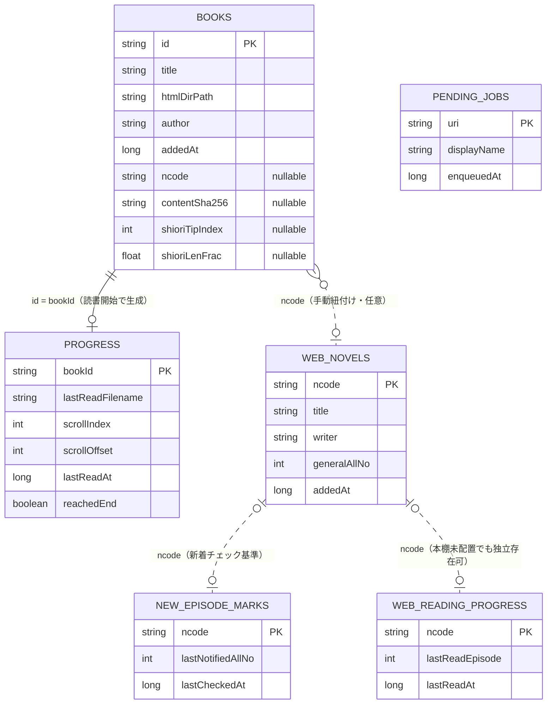

# DB ER図（Room / AppDatabase version 19）

`android/app/src/main/java/com/novelreader/data/AppDatabase.kt`（version 19）に登録された
6エンティティの実体関係図。Room の `@ForeignKey` 宣言は使われておらず、テーブル間の結びつきは
`id` / `ncode` 文字列の一致による**アプリケーション側の規約**に留まる（本図の破線はその論理的な関連を示す）。

正本は各 `*Entity.kt` と `AppDatabase.kt`。本図はスナップショットであり、スキーマ変更時の
追従義務は負わない（`/stale-check` の対象外＝churny な現況ではなく構造の見取り図のため）。

## エンティティ関係図

凡例: 実線 = bookId 経由の1:1（読書開始時に生成）／破線 = ncode 文字列一致による論理的関連（FK制約なし）。

## テーブル別ノート

| テーブル | 役割 | 備考 |
|---|---|---|
| `books`（PK `id`） | 蔵書 — 取込済みPDFのメタデータ | `ncode` は「なろう作品との紐付け」用（nullable）。誤爆防止のため自動判定ではなく候補提示→ユーザー確定でのみ埋まる |
| `progress`（PK `bookId`） | 蔵書 — 読書位置・読了実績 | `reachedEnd` は「最終章の末尾に実際に到達した」ことのみで立つ事実ベースのフラグ（進捗率からは導出しない） |
| `pending_jobs`（PK `uri`） | ジョブ — 変換待ち・変換中キューの永続化 | 他テーブルと無関係の孤立エンティティ。OEM kill / OOM からの再開検出専用 |
| `web_novels`（PK `ncode`） | なろう — 未取込の「本棚に置いた」作品カード | `books` とは別テーブル（未取込前提の緩い不変条件を books に波及させないため） |
| `new_episode_marks`（PK `ncode`） | なろう — 新着話の通知基準値 | 「前回通知済み話数」を保持し、増分があった時だけ通知する差分基準 |
| `web_reading_progress`（PK `ncode`） | なろう — WebView読書の続き再開位置 | 「最大到達話」を記録（furthest-wins）。目次から前話を確認しても再開先端は後退しない |

### ncode という共有キー空間について

`books.ncode` / `web_novels.ncode` / `new_episode_marks.ncode` / `web_reading_progress.ncode` の4列は、
いずれも大文字正規化済みの「なろう作品識別子」という同じ値空間を指す。Room 上に `@ForeignKey` は無く、
整合性は Repository 層の呼び出し規約で保たれている。図では代表的な経路（books→web_novels→他2テーブル）のみを
破線で示した。

## スキーマ履歴の要点

| version | 変更 |
|---|---|
| v8 | `pending_jobs` 新設（強制終了からの再開材料） |
| v9 | `books.ncode` 追加（PDF↔Web継続読書の紐付けキー） |
| v11 | `books.contentSha256` 追加（同一内容PDFの再取込防止） |
| v12 | `web_novels` 新設（未取込カード） |
| v13 | `new_episode_marks` 新設 |
| v14 → v16 | `labels` / `book_labels`（多対多ラベル機能）を新設 → 撤去。読書状態の導出値へ置換されたため付与データごと削除済み（本図には含まない） |
| v15 | `web_reading_progress` 新設（なろうWebView読書の続き再開） |
| v18 | `progress.reachedEnd` 追加（読了フラグの事実ベース化） |
| v19 | `books.shioriTipIndex` / `shioriLenFrac` 追加（栞書影の個体差を取込時に抽選・固定） |
